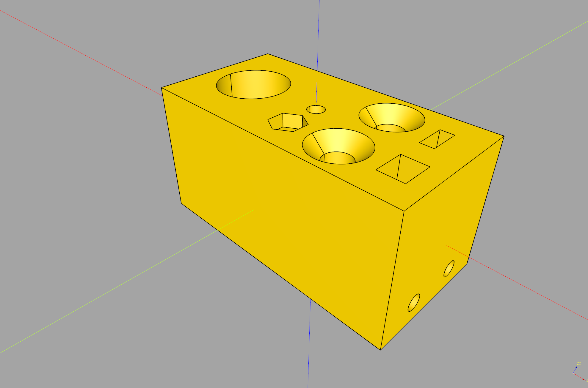

# cq-queryabolt
A quick way to create nutcatches, screw holes and countersinks in CadQuery, according to fastener standards.

.

## Requirements and installation

```py
poetry add cq-queryabolt
```

## Usage

To create a simple box with a bolt hole and a nutcatch:
```py
import queryabolt
import cadquery as cq

class Workplane(queryabolt.WorkplaneMixin, cq.Workplane):
    pass

box = Workplane().box(25, 10, 10)

# A nutcatch on the bottom:
result = box.faces("<Z").workplane().tag("center").nutcatchParallel("M3")

# And a bolt hole through:
result = result.faces(">Z").workplane().boltHole("M3")

show_object(result, name="simple")
```

Or check out the example [showcasing all the features](./examples/simple.py), or [using a `cadquery.Assembly`](./examples/assembly.py).

## API

### `queryabolt.WorkplaneMixin`

#### `boltHole(bolt: string, depth: Optional[float] = None)`
Make a bolt hole (`cadquery.Workplane.hole` for named fasteners)

Args:
* `bolt` (`str`): name of the bolt (e.g. `"M3"`)
* `depth` (`float >= 0` or `None` to cut through the entire part): how deep to make the hole

#### `cboreBoltHole(bolt: str, depth: Optional[float] = None, headDiameterClearance: Optional[float] = 0.1)`
Make a counterbored hole (`cadquery.Workplane.cboreHole` for named fasteners)

Args:
* `bolt` (`str`): name of the bolt (e.g. `"M3"`)
* `depth` (`float >= 0` or `None` to cut through the entire part): how deep to make the hole
* `headClearance` (`float >= 0`, optional): additional bolt head clearance. Defaults to 0.1.

#### `cskBoltHole(bolt: string, depth: Optional[float] = None)`
Make a countersunk hole (`cadquery.Workplane.cskHole` for named fasteners)

Args:
* `bolt` (`str`): name of the bolt (e.g. `"M3"`)
* `depth` (`float > 0` or `None` to cut through the entire part): how deep to make the hole

#### `nutcatchParallel(options: string, kind: Optional[string] = "hexagon", heightClearance: Optional[float] = 0)`
Make a parallel (surface) nutcatch

Args:
* `options` (`str`): name of the nut (e.g. `"M3"`)
* `kind` (`str`, optional): kind of the nut (e.g. `"hexagon"`). Defaults to `"hexagon"`.
* `heightClearance` (float, optional): height clearance for the nut. Defaults to 0.

#### `nutcatchSidecut(options: string, kind: Optional[string] = "hexagon", heightClearance: Optional[float] = 0, depth: Optional[float] = None)`
Make a side-cut nutcatch

Args:
* `options` (`str`): name of the nut (e.g. `"M3"`)
* `kind` (`str`, optional): kind of the nut (e.g. `"hexagon"`). Defaults to `"hexagon"`.
* `heightClearance` (`float >= 0`, optional): additional height clearance for the nut. Defaults to 0.
* `depth` (`float > 0` or `None` to cut through the entire part): how deep to make the sidecut. Defaults to `None`.

## Acknowledgements
* The [authors](https://github.com/boltsparts/boltsparts/graphs/contributors) of the [BOLTS](https://github.com/boltsparts/boltsparts) library

## Prior work
The following turned out too verbose for the simpler end of the spectrum of my projects:
* [`cqparts_fasteners`](https://cqparts.github.io/cqparts/doc/cqparts_fasteners/index.html)
* [`cq_warehouse`'s `fastener` module](https://cq-warehouse.readthedocs.io/en/latest/fastener.html)

Similar library for OpenSCAD, by yours truly:
* [`catchnhole`](https://github.com/mmalecki/catchnhole)
